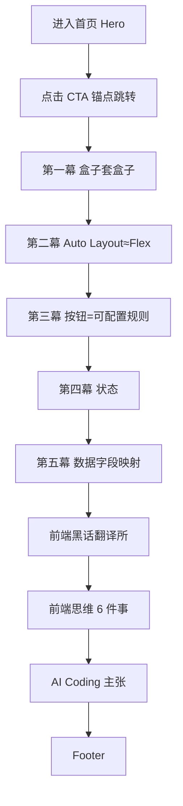

## 1. 产品概述

一个面向设计师的前端认知科普网站首页，用轻量、有趣的互动故事，带设计师看看一张 Figma 设计稿进入前端世界后会发生什么。
- 核心观点：设计师不需要转前端，但需要懂前端的思考方式。这里不教写代码，只带你看研发到底怎么理解你的 Figma。
- 目标用户：产品体验设计师、UI/UX 设计师、做 Design System / Design Skill / AI Coding / PRD to Code 的设计师、想理解前端但不想写代码的设计师。产品价值在于提升设计交付质量与 AI Coding 时代的生成质量。

## 2. 核心功能

### 2.1 功能模块
本产品为单页（首页）营销 / 科普网站，包含以下核心区块：
1. **首页 (Home)**：顶部导航、Hero 首屏、五幕故事、前端黑话翻译所、前端思维知识地图、AI Coding 主张、页脚。

### 2.2 页面详情
| 页面名称 | 模块名称 | 功能描述 |
|-----------|-------------|---------------------|
| 首页 | 顶部导航 Header | 展示站点标识与锚点导航（五幕、翻译所、知识地图），移动端收起为简化菜单；滚动时轻微背景模糊/描边。 |
| 首页 | Hero 首屏 | 左侧主标题「设计稿进入前端世界后」+ 副标题 + 两个按钮（看看设计稿会变成什么 / 进入前端黑话翻译所，锚点跳转）；右侧可视化卡片表达 Figma 设计稿 → 盒子 → 组件树 → 代码 的「翻译」过程，带入场动画。 |
| 首页 | 第一幕·盒子套盒子 | 左右对照：设计师视角文案 vs 前端视角文案；右侧展示 OrderCard 组件树（缩进层级结构），传达前端在拆结构而非照着画。 |
| 首页 | 第二幕·Auto Layout≈Flex | 左右对照卡片，Figma Auto Layout（横排/竖排/间距/对齐）对照 Frontend Flex（display / flex-direction / gap / align-items / justify-content），用标签化、可视化方式呈现。 |
| 首页 | 第三幕·按钮是可配置规则 | 展示 Button 组件配置卡片：type / size / state / icon 等可选值，用可点击标签切换预览按钮外观；传达 Figma Variant ≈ Frontend Props。 |
| 首页 | 第四幕·状态 | 用小卡片展示 Loading / Empty / Error / Disabled / Selected 五种状态，附小图示，传达状态是前端实现必需信息。 |
| 首页 | 第五幕·数据字段映射 | 轻量数据映射示例：商品名称→productName、订单金额→orderAmount、用户昵称→buyerName、订单状态→orderStatus；传达页面内容背后有数据来源。 |
| 首页 | 前端黑话翻译所 | 翻译卡片列表：前端说 → 设计师听「？？？」→ 翻译。词条含「包一层 div」「这个走组件库」「这里要补状态」「这个字段接口没有」「这个布局不好响应式」「这里可以抽组件」。 |
| 首页 | 前端思维 6 件事 | 6 个知识卡片：01 盒子 Box、02 布局 Layout、03 组件 Component、04 状态 State、05 数据 Data、06 交付 Delivery，各含一句说明，编号视觉化。 |
| 首页 | AI Coding 主张 | 文案区 + 流程图：Design → Component → Layout → State → Data → Code，强调结构化上下文提升 AI 生成质量。 |
| 首页 | 页脚 Footer | 文案「把前端黑话，翻译成设计师听得懂的人话。」+ 站点信息。 |

## 3. 核心流程

用户进入首页，被 Hero 的好奇钩子吸引 → 点击「看看设计稿会变成什么」滚动进入五幕故事，逐幕理解盒子 / 布局 / 组件 / 状态 / 数据 → 进入「前端黑话翻译所」轻松化解沟通黑话 → 浏览「前端思维 6 件事」形成知识地图 → 阅读 AI Coding 主张理解现实意义 → 到达 Footer。

## 4. 用户界面设计

### 4.1 设计风格
- **主色 / 辅色**：浅色背景（近白 #FBFBFD / 柔雾白），主强调色采用柔和的靛蓝到青绿的低饱和渐变，辅以珊瑚橙 / 琥珀作为「设计师视角」高亮，青蓝作为「前端视角」高亮；整体低饱和、通透。
- **按钮风格**：圆角（约 12px）胶囊 / 大圆角矩形，主按钮为渐变填充 + 轻微阴影，次按钮为描边 + 毛玻璃；hover 有轻微上浮与阴影加深。
- **字体**：显示 / 标题字体使用有设计感的无衬线（英文 Space Grotesk 备选之外，采用 Sora / Manrope 类几何人文无衬线以区别于常见 Inter），正文中文使用系统苹方 / 思源黑体栈，代码 / 标签使用等宽（JetBrains Mono / IBM Plex Mono）。标题层级清晰，H1 大而克制。
- **布局风格**：卡片式 + 左右对照式分屏；大量留白，柔和渐变背景，轻微阴影与细描边；「翻译」隐喻贯穿——设计侧与前端侧用两种色系区分。
- **图标 / emoji**：使用线性极简图标（自绘 SVG 或轻量图标），克制使用少量 emoji 作为情绪点缀（如？？？），不堆砌。

### 4.2 页面设计概览
| 页面名称 | 模块名称 | UI 元素 |
|-----------|-------------|-------------|
| 首页 | Header | 半透明毛玻璃背景，滚动出现描边；左 Logo 文字，右锚点链接；移动端汉堡/简化。 |
| 首页 | Hero | 左文右图不对称布局；主标题渐变文字；右侧「设计稿→盒子→组件树→代码」分层卡片，带入场 stagger 动画与连接线。 |
| 首页 | 五幕 StorySection | 交替左右对照卡片；设计师侧暖色，前端侧冷色；组件树用等宽字体缩进 + 连接线；滚动进入淡入上移。 |
| 首页 | 翻译所 TranslationCard | 三段式卡片（前端说 / 设计师听 / 翻译），hover 轻微翻转或高亮；网格排列。 |
| 首页 | 知识地图 KnowledgeCard | 6 卡片网格，大号编号，柔和渐变角标，hover 上浮。 |
| 首页 | ProcessFlow | 横向流程胶囊 + 箭头连接，移动端转为纵向；节点带图标。 |
| 首页 | Footer | 浅色分隔，居中文案，轻量。 |

### 4.3 响应式
桌面优先设计，向下适配平板与移动端。桌面端使用左右分屏 / 多列网格；移动端所有对照卡片堆叠为单列，组件树与流程图纵向排列，导航收起，字号与间距按断点缩放，保证触控目标 ≥ 44px。断点参考 sm 640 / md 768 / lg 1024 / xl 1280。
