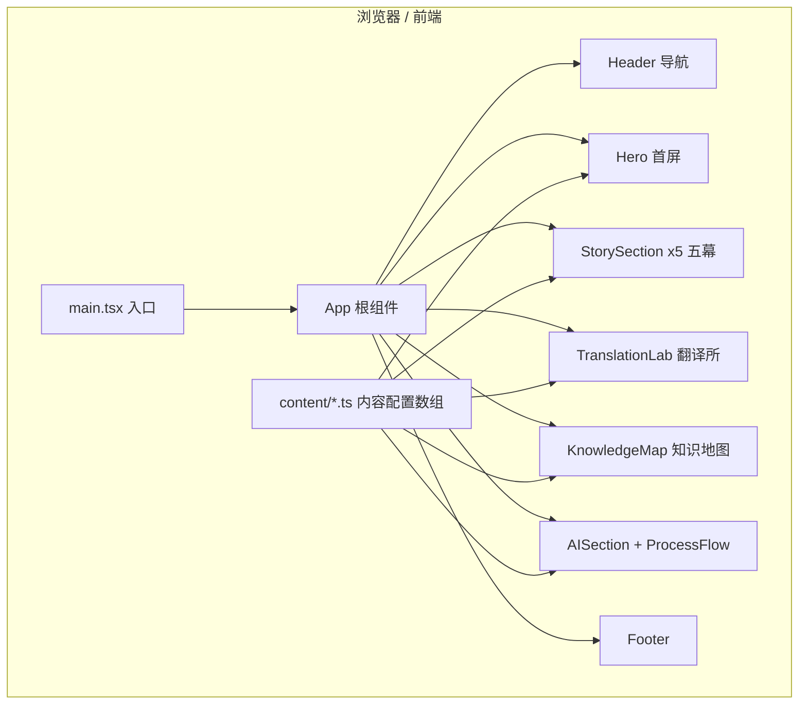

## 1. 架构设计

本项目为纯前端单页静态站点，无后端、无数据库、无登录。所有内容以数组配置驱动，组件化渲染。



## 2. 技术描述
- 前端：React@18 + TypeScript + Tailwind CSS@3 + Vite
- 初始化工具：Vite（react-ts 模板）
- 动画：以 CSS / Tailwind 过渡与 IntersectionObserver 实现滚动进入动画为主，避免引入过重依赖；如需可选引入 framer-motion（优先 CSS 方案，保持轻量）
- 字体：通过 Google Fonts / 本地字体栈引入 Sora / Manrope（标题）、JetBrains Mono（代码标签），中文回退苹方 / 思源黑体
- 后端：无
- 数据库：无（内容为静态数组配置，位于 src/content/）

## 3. 路由定义
单页应用，仅首页，区块通过锚点（#story / #lab / #map 等）内部跳转。
| 路由 | 用途 |
|-------|---------|
| / | 首页，包含全部区块 |
| /#story | 锚点：五幕故事起点 |
| /#lab | 锚点：前端黑话翻译所 |
| /#map | 锚点：前端思维知识地图 |

## 4. API 定义
无后端，无 API。

## 5. 组件与目录结构

```
src/
├── main.tsx                # 应用入口
├── App.tsx                 # 根组件，串联各区块
├── index.css               # Tailwind 指令 + 全局样式 / 字体 / CSS 变量
├── components/
│   ├── Header.tsx          # 顶部导航（锚点 + 移动端菜单）
│   ├── Hero.tsx            # Hero 首屏（左文案 + 右可视化翻译卡）
│   ├── SectionHeading.tsx  # 通用区块标题（幕次标签 + 标题）
│   ├── StorySection.tsx    # 通用「左右对照」幕布局容器
│   ├── ComponentTree.tsx   # 组件树可视化（第一幕）
│   ├── FlexCompare.tsx     # Auto Layout≈Flex 对照（第二幕）
│   ├── ButtonConfigCard.tsx# 按钮可配置规则交互卡（第三幕）
│   ├── StateCard.tsx       # 状态小卡片（第四幕）
│   ├── DataMapping.tsx     # 数据字段映射（第五幕）
│   ├── TranslationCard.tsx # 黑话翻译卡片
│   ├── KnowledgeCard.tsx   # 知识地图卡片
│   ├── ProcessFlow.tsx     # Design→...→Code 流程图
│   ├── AISection.tsx       # AI Coding 主张区块
│   ├── Footer.tsx          # 页脚
│   └── Reveal.tsx          # 滚动进入动画包装器（IntersectionObserver）
├── content/
│   ├── stories.ts          # 五幕文案与结构数据
│   ├── translations.ts     # 黑话翻译词条数组
│   ├── knowledge.ts        # 6 件事知识卡片数组
│   ├── buttonConfig.ts     # 按钮配置项数据
│   ├── states.ts           # 状态卡片数组
│   ├── dataFields.ts       # 数据字段映射数组
│   └── process.ts          # 流程节点数组
└── types.ts                # 共享 TypeScript 类型定义
```

设计原则：内容与展示分离，所有文案 / 列表数据放在 src/content/ 下的数组配置中，组件仅负责渲染与交互，便于后续扩展词条与幕次。

## 6. 数据模型

无持久化数据库。前端内容数据类型（src/types.ts）示意：

```typescript
// 组件树节点
export interface TreeNode {
  name: string;
  children?: TreeNode[];
}

// 一幕故事
export interface Story {
  id: string;            // 锚点/序号
  act: string;           // 「第一幕」
  title: string;
  designerView?: string; // 设计师视角文案
  frontendView?: string; // 前端视角文案
  approx?: string;       // 「Figma X ≈ Frontend Y」
}

// 黑话翻译词条
export interface Translation {
  frontendSays: string;  // 前端说
  designerHears: string; // 设计师听
  translation: string;   // 翻译
}

// 知识卡片
export interface Knowledge {
  no: string;            // "01"
  en: string;            // "Box"
  zh: string;            // "盒子"
  desc: string;
}

// 按钮配置维度
export interface ButtonConfig {
  prop: string;          // "type"
  options: string[];     // ["primary","secondary","danger"]
}

// 页面状态
export interface UIState {
  key: string;           // "loading"
  label: string;         // "Loading 加载中"
  desc: string;
}

// 数据字段映射
export interface DataField {
  zh: string;            // "商品名称"
  field: string;         // "productName"
}

// 流程节点
export interface FlowNode {
  label: string;         // "Design"
}
```
